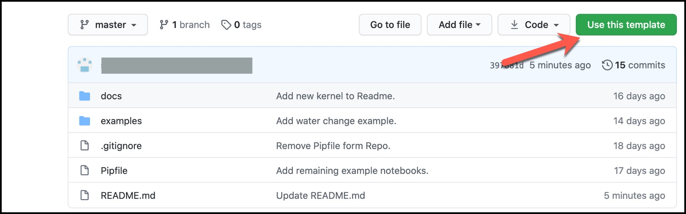
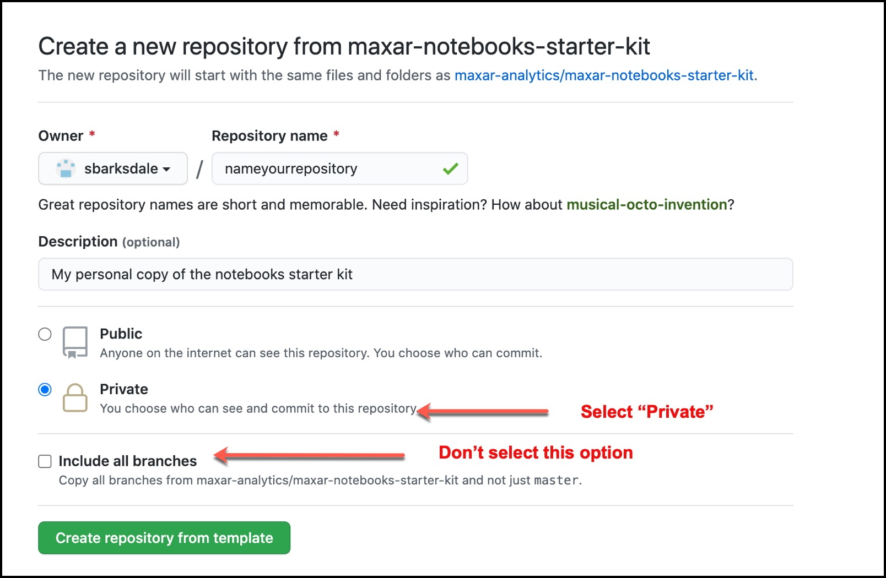
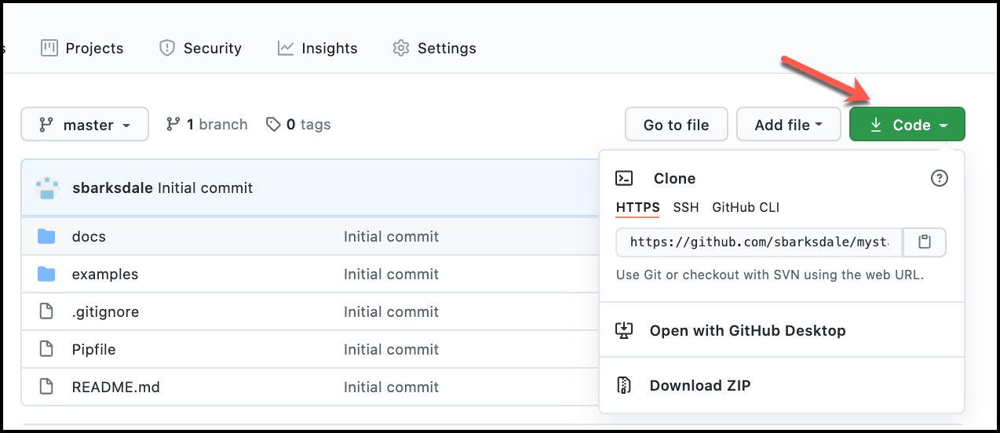
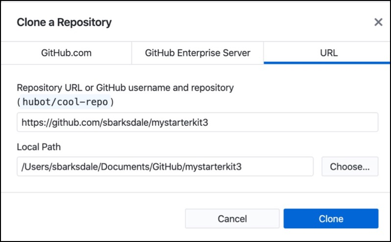
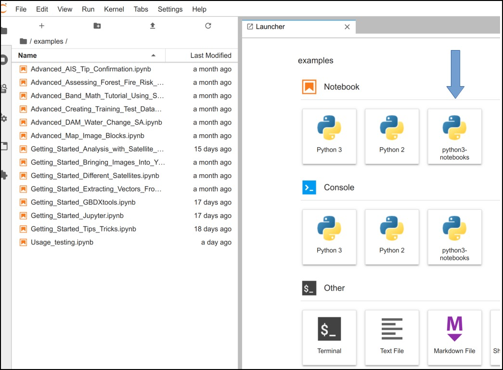
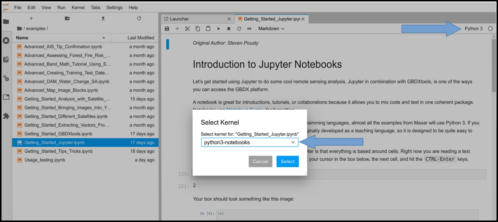
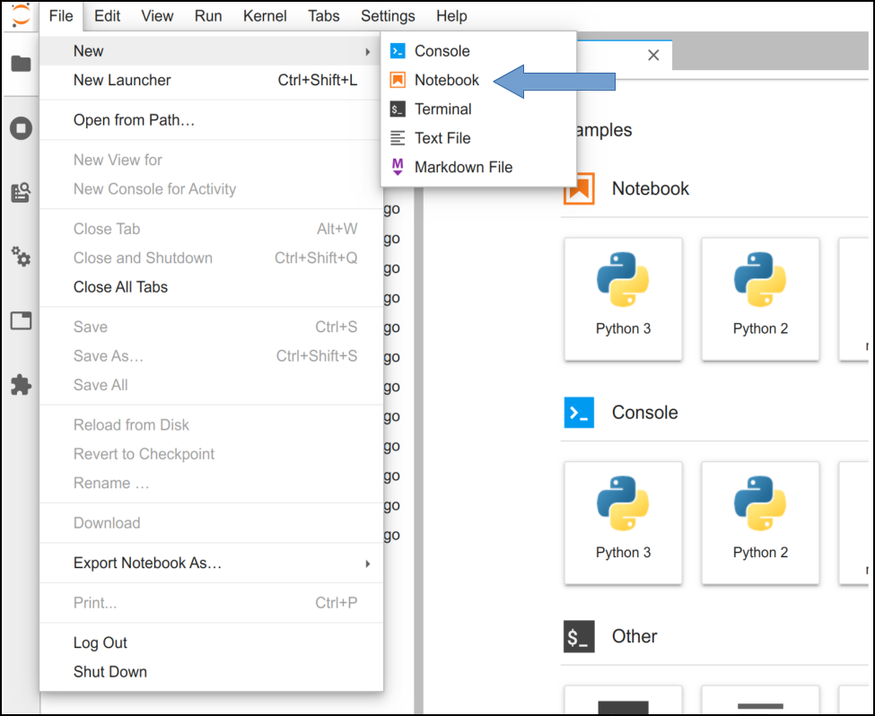
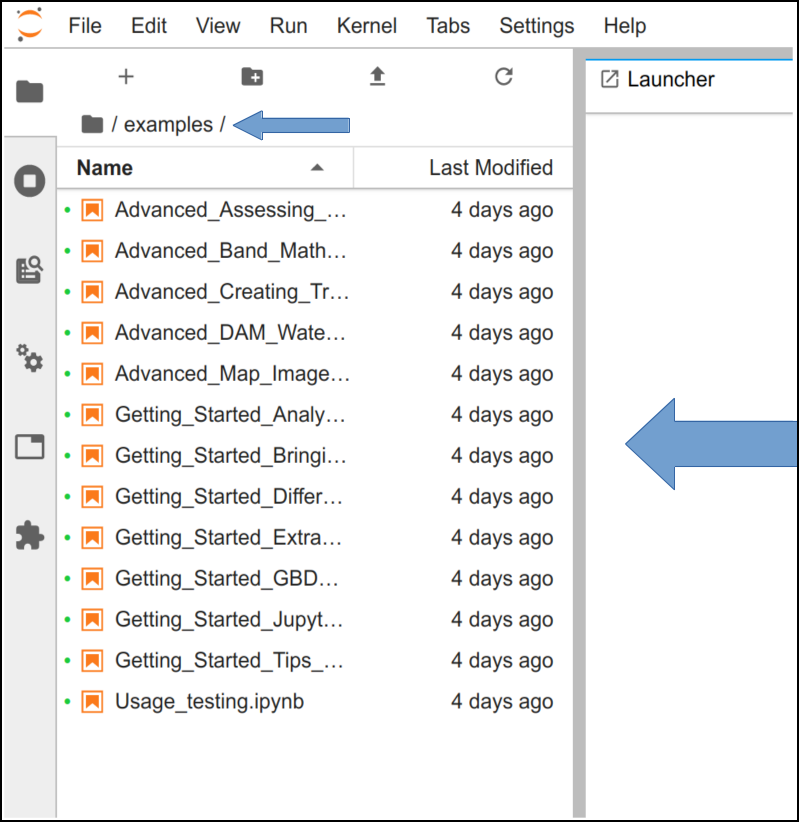
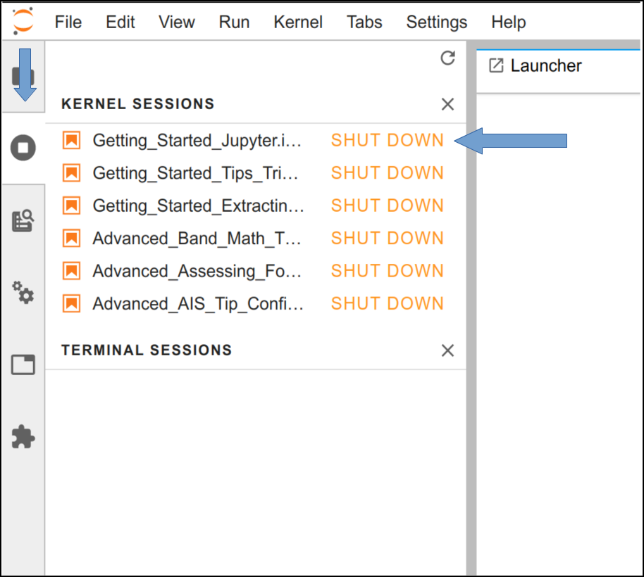

|Contents|
|---|
|[Prerequisites](#prerequisites)|
|[Set up the Notebooks Starter Kit](#set-up-the-notebooks-starter-kit)|
|[Run GBDXTools in Jupyter Lab](#run-gbdxtools-in-jupyter-lab)|
|[Working with Notebooks](#working-with-notebooks)|
|[Additional Help Topics](#additional-help-topics)|

# Maxar Notebooks Starter Kit

The Starter Kit is a template repository for users who want a quick start guide to running Jupyter with GBDXtools. Example notebooks are included in the repository.

It is assumed that users of this starter kit will have a basic knowledge of Git and Github.

## Prerequisites

Before using the Notebooks starter kit, set up the following prerequisites:

### Commands

All the commands in this document are for use in your systems shell. If you are on a system with MacOS, Windows, or Linux, the commands will be the same. Any references to terminal is meant to be interchangable with Windows Powershell, MacOS terminal, Linux terminal, or any other.

### A config file with GBDX credentials

This file provides access to GBDX from your Notebooks starter kit. If you are a GBDXtools user, you may already have this file configured.

Create this file in your root directory:

```shell
~/.gbdx-config
```

Example:

```shell
C:\Users\{username}\.gbdx-config
```

Add your GBDX credentials to the file in the following format:

```shell
[gbdx]
user_name = [yourusername@yourdomain.com]
user_password = [yourgbdxpassword]
```

### Python 3 Development Environment

The following is a recommended way of getting up and running with standard Python. If you already have a Python development environment using Conda, or you would prefer to use a docker container, see these [alternate](docs/alternate_envs.md) instructions. Once your dev environment is configured, jump to the [Run GBDXTools in Jupyter Lab](#run-gbdxtools-in-jupyter-lab) section.

#### Install Python 3 (we recommend 3.8.x)

  To check which version of Python you have installed, open a terminal window. At the command prompt, type:

```shell
python --version
```

If you need to install or update your Python version, download from [python.org](https://www.python.org/downloads/). The Hitch Hiker's Guide to Python has good instructions for various platforms on [how to install python](https://docs.python-guide.org/starting/).

#### Pipenv

Pipenv is a simple dependency manager for Python projects. You will need `pipenv` to install dependencies needed for the Notebooks starter kit.

To check which version of Pipenv you have installed, open a terminal window. At the command prompt, type:

```shell 
pipenv --version
```

If you need to install or update Pipenv, follow these instructions for [installing pipenv](https://docs.python-guide.org/dev/virtualenvs/) or the [pipenv documentation](https://pipenv.pypa.io/en/latest/)

## Set up the Notebooks starter kit

### 1. Copy the Starter kit template to a personal Github repository

To create a personal repository from this template, select the "Use this template" button from the top of the [starter kit directory](https://github.com/maxar-analytics/maxar-notebooks-starter-kit).



Enter the following information:

- Owner (required): Choose your github name or your organization's github location from the dropdown menu. Do not select Maxar Analytics from the dropdown.
- Repository name (required): Choose a name that's easy to remember your starter kit repository.
- Description (optional): Add a few words that describe this repository.
- Public or private: Choose private
- Include all branches: Do not select this option. Leave the box blank.

Once you've completed these steps, select the "create repository from template" button.



### 2. Clone your personal repository to your local machine

Select the green `Code` button at the top of the directory. This opens a menu with several options for cloning the repository to your local machine.



Github Desktop is a user interface for interacting with GItHub. Choosing "Open with Github Desktop" is a simple way to see way to view or select the local path the starter kit will be copied to. 



Note: Keep track of the location the repo is shared to. You'll need it for the next step.

### 3. Install the virtual environment to the root of your local repository

 Installing the virtual environment will add required dependencies such as Jupyter Labs and GBDX Notebooks. You can find a list of the dependencies in the [Pipfile](Pipfile).
  
Open a terminal window and change directories (`cd`) into the folder for the cloned repo. To learn about using the `cd` command to change directories, see "Additional Help Topics" at the bottom of this page. 

To setup the environment, run:

```shell
pipenv install
```

This repository uses Jupyter Lab, documentation can be found here: https://jupyterlab.readthedocs.io/en/stable/

### 4. Install the kernel

Before starting the server, we will add a kernel for use in the Jupyuter notebooks:

```shell
pipenv run python -m ipykernel install --user --name=python3-notebooks
```

## Run GBDXTools in Jupyter Lab

If Jupyter Lab is not already running, run the following to start it. The command must be run from the **root** of your repository for your files to show up in the sidebar.

> Note: if you are using Conda or Docker, see those [docs](docs/alternate_envs.md) for how to start the server.

```python
pipenv run jupyter lab
```

Use this command to open Jupyter Lab every time. This will open Jupyter Lab in your default browser showing all the files from the directory you started the server in. When you are done, you can close the browser and in the shell press <Ctrl+C> to stop the server.

> Note: If you can't open Jupyter in your browser because it is asking for a password, try copying the url from the shell with the token, and open it in your browser. If that doesn't work, you can disable auth by running: `jupyter lab --NotebookApp.token='' --NotebookApp.password=''`. Note that this removes authentication from the running server, and anyone with access to your computer can access the server.

### Setting the Kernel

To keep all the dependencies isolated in the pipenv environment, you will need to make sure you use the correct kernel in your notebook. You will only need to select the kernel once for each notebook, and Jupyter will remember it.

To open a new notebook with your new kernel:



When opening an existing notebook, you will have to select the new kernel. To do this, select the label in the top right and a popup will give you a list of kernels to choose from:



## Working with Notebooks  
  
### Upload an existing notebook

If you are using notebooks locally, any existing notebooks can be moved to the directory of your new repository, and they will show up in the Jupyter tree immediately. To push those notebooks to your repository, you need to run the `git push ...` command. An example would be as follows:

```shell
git commit --all --message "Adding more notebooks"
git push
```

> Note: The structure of this directory is not important, so organize to suit your needs.
  
### Create a new notebook

To open a new notebook, with the new kernel you created before, select the kernel from the Launcher:


Alternately, you can create a new notebook file from the file menu:


  
### Run an example notebook

When you run Jupyter from the root of your repository, all the files in that location will be in the Jupyter file browser in the left sidebar.



To run an example notebook, double click the examples directory in the file browser, and double click on any of the notebooks.

To run the cells in a notebook, select the cell and type shift + enter. We recommend running the cells within a notebook in order so that no dependencies are missed. Running a cell without running the cells before it may result in an error.
  
### Share a notebook

To share a notebook with another Github user, the notebook needs to be committed and pushed to Github. More information can be found in the sharing document [here](docs/sharing.md).

## Additional Help Topics

### Manage Running Kernels

In Jupyter, each notebook has dedicated resources tied to a kernel session. When opening a bunch of notebooks, your computers resources will be consumed. It is good practice to check the running kernel sessions periodically and shutdown the sessions that are not required. You won't lose any data, but your system resources will be released. To find the running sessions, click on the sidebar as shown below:



Clicking `SHUT DOWN` will close the session.
  
### Accessing the root directory for your local repository

When cloning your new notebooks repository, pick a location under your user directory. On MacOS and Linux your user directory will be `~/<username>/`, and on Windows it will be `C:\Users\{username}\`. The following are examples of cloning and navigating.

#### MacOS/Linux

From terminal:

```shell
cd ~/<username>/
git clone https://github.com/<github_username>/<my_notebook_repo_name>.git
cd my_notebook_repo_name
```

#### Windows

From a command prompt or power shell:

```shell
cd C:\Users\{username}\
git clone https://github.com/<github_username>/<my_notebook_repo_name>.git
cd my_notebook_repo_name
```
  
## Example Notebooks

Example notebooks can be found in the `examples` directory.

### Getting Started

- [Introduction to Jupyter](examples/Getting_Started_Jupyter.ipynb)
- [GBDXtools](examples/Getting_Started_GBDXtools.ipynb)
- [Different Satellites](examples/Getting_Started_Different_Satellites.ipynb)
- [Bringing Images Into Your Notebook](examples/Getting_Started_Bringing_Images_Into_Your_Notebooks.ipynb)
- [Analysis with Satellite Images](examples/Getting_Started_Analysis_with_Satellite_Images.ipynb)
- [Extracting Vectors From Images](examples/Getting_Started_Extracting_Vectors_From_Images.ipynb)
- [Tips & Tricks](examples/Getting_Started_Tips_Tricks.ipynb)

### Advanced

- [Map Image Blocks](examples/Advanced_Map_Image_Blocks.ipynb)
- [Band Math Tutorial using SWIR Imagery](examples/Advanced_Band_Math_Tutorial_Using_SWIR_Imagery.ipynb)
- [DAM Water Change SA](examples/Advanced_DAM_Water_Change_SA.ipynb)
  
