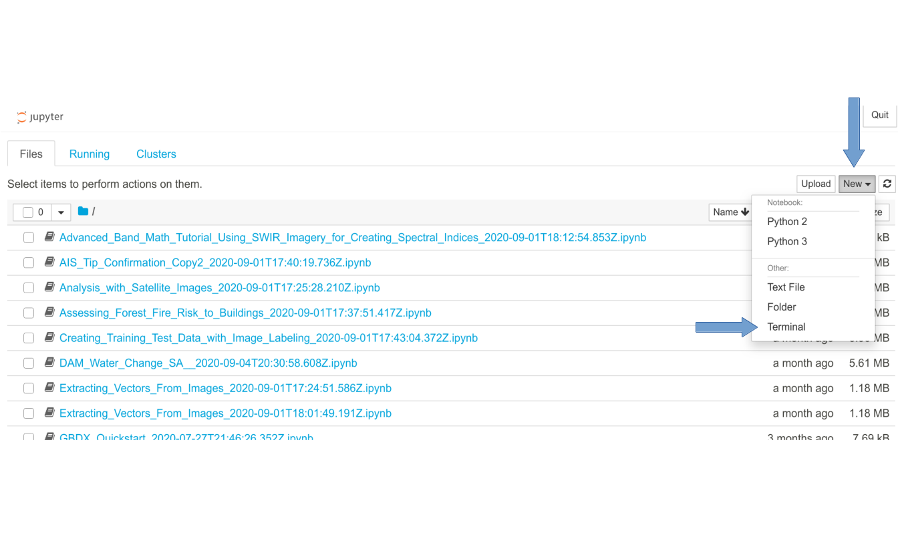
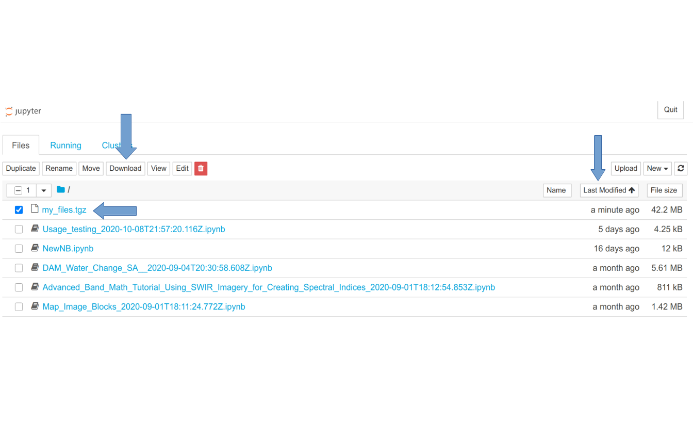

# Move Files from Maxar Notebooks

The general steps to download your files from GBDX Notebooks are to create an archive, download it, and extract the files into your new repository.

## Create an Archive

Navigate to [https://notebooks.geobigdata.io/juno/notebook/tree](https://notebooks.geobigdata.io/juno/notebook/tree), and in the top right hand corner, click `new`, and select `terminal`. As shown below:



In the new terminal window that opens, type the following command (copy and paste does not work):

```shell
tar -zcvf my_files.tgz *
```

This will archive all the files in your user directory.


> Note: The more files and data will increase the size of the archive and may cause issues. It is recommended to go through all your files and any unecessary data and remove it before running the command. If you have a large number of files to archive (more than 1000 individual files) or if your copy fails, contact [GBDX Support](mailto:gbdx-support@maxar.com).

Back on the browser tab still open to [https://notebooks.geobigdata.io/juno/notebook/tree](https://notebooks.geobigdata.io/juno/notebook/tree), you should now see `my_files.tgz` in the file tree. Select the box next to it, and click `download` at the top. If you have a lot of files, use the `last modified` sorting to move it to the top. These steps are shown in the below image:



> When you download the archive put it somewhere outside your repo so it doesn't get added. 

## Extract an Archive

Once you have downloaded the git repo, open a terminal (or power shell on Windows) and navigate to the download location. Then run the command below:

```shell
tar -xf ./my_files.tgz -C ~/<my_notebook_repo>/
```

When complete, you can add, commit, and push your files to your new repo. More details on this can be found in the [README.md](../README.md).

## Additional Information:

### Metadata and settings
In the GBDX Notebooks application, additonal settings and metadata could be set for the notebook such as author's name, description, search tags, and a private or public setting. This data is not part of the notebook file and will not be copied with the notebook. Python version and kernel version are retained in the notebook.

### Reduce file size of a notebook
Github limits file sizes to 100 MB. While it's rare that a notebook file would reach that limit, it is possible. One way to reduce the file size is to clear the output cells. 

From the Jupyter menu in GBDX Notebooks, select Cell > all outputs >clear.


