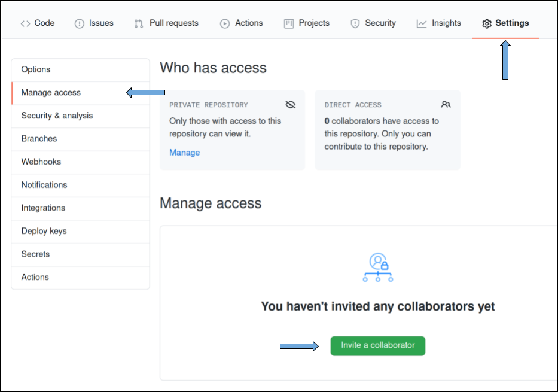
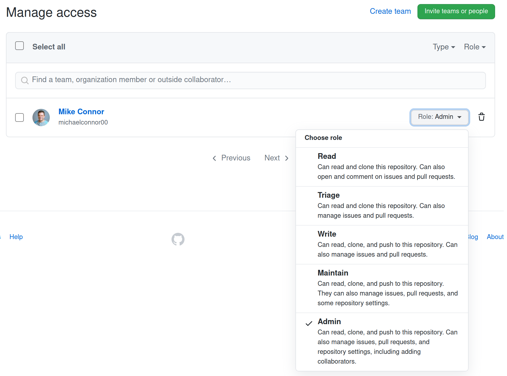

# Sharing Notebooks

Sharing notebooks is done through your cloned Github repository. In Github terminology, sharing is called *access*.

In order to allow access to your files, you will need to keep your Github repository up to date. This document will not cover how to use `git`, as it is assumed the user of this guide will have basic git knowledge.

## Access Scope

With Github, the access is only scoped to the repository. Meaning, you cannot share just one file. So sharing your repository with another Github user, will share all files in the repository (assuming it is a private repository).

## All Access to Repository

From your repository, go to the settings tab. Then on the left select `Manage access`, then select `Invite a collaborator`. From the pop up, you can search for a Github user.

Once you found and selected a user, they will show up in the list. They will need to accept the invitation, then you will be able to change the role of the person. In the drop down, each role has a description, so you can choose which one applies.

To delete a user, select the garbage can icon on right side of the Role drop down.

